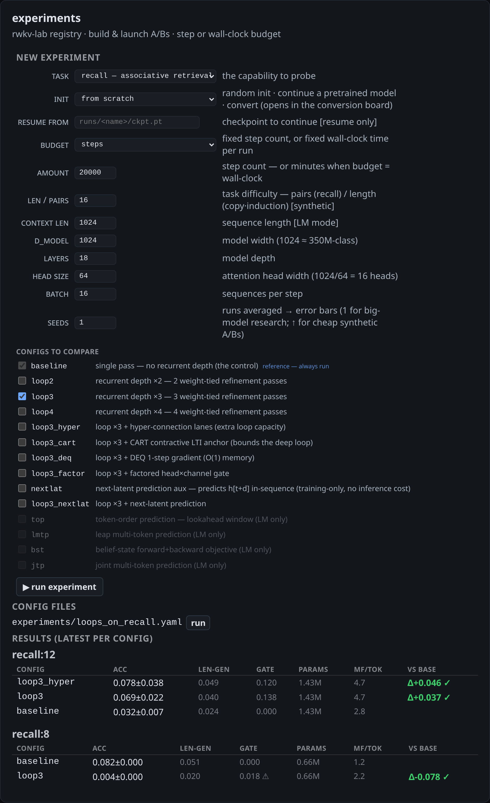
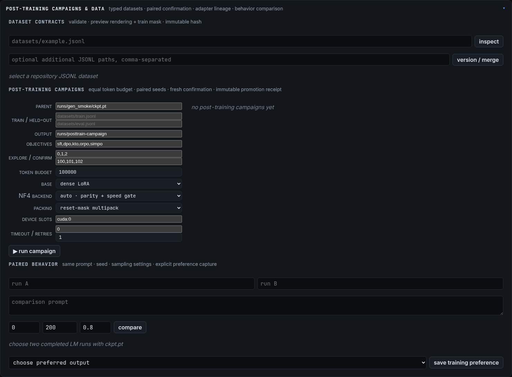

# RWKV-Lab

[](https://github.com/sirus20x6/rwkv-lab/actions/workflows/tests.yml)

**An experimental toolbox for state-of-the-art LLM techniques on RWKV linear-attention cores.**

RWKV-Lab implements a broad, growing set of recent research techniques — recurrent-depth **loops**, **latent-prediction** objectives, **memory / retrieval** modules, **Muon-family optimizers**, and cross-architecture **conversion** — as composable, unit-tested, **off-by-default** levers on RWKV-7/8 cores. Every technique maps to a paper (linked in [References](#references)) and a test; at default flags the code reproduces the plain baseline, so each lever can be A/B'd in isolation.

The lab grew out of one concrete goal — losslessly turning a pretrained Transformer / gated-linear-attention model into RWKV *without* pretraining from scratch — and kept absorbing SOTA ideas from the RWKV research community and the literature. That conversion track is still here (and produced a clean lossless result, below); it's now one capability among several.

## What's in the box

Every entry is an off-by-default lever with a paper and a CPU test. Full index in [References](#references).

| Area | Techniques | Modules |
|---|---|---|
| **Recurrent-depth loops** | weight-tied loops · hyper-connections · per-iterate readout · PonderNet halt · CART contractive gate · HRM DEQ / Neumann-k gradient · FPRM fixed-point halt · RWKV-Product multi-substep | [`looped_rwkv`](src/rwkv_lab/looped_rwkv.py) · [`rwkv_product`](src/rwkv_lab/rwkv_product.py) |
| **Latent prediction** | MTP · MuToR · TOP · NextLat · ConceptLM · FSP · L-MTP · Belief-State · JTP · LLM-JEPA · Coconut continuous-thought | [`lookahead_module`](src/rwkv_lab/lookahead_module.py) · [`llm_jepa`](src/rwkv_lab/llm_jepa.py) · [`coconut`](src/rwkv_lab/coconut.py) |
| **Memory / retrieval** | Engram lexical bank · ROSA suffix-automaton (+ golden reference) · Fast-weight Product-Key Memory · L³ large-lookup · WriteSAE state autoencoder | [`engram_lmb`](src/rwkv_lab/engram_lmb.py) · [`rosa_sam`](src/rwkv_lab/rosa_sam.py) · [`fwpkm`](src/rwkv_lab/fwpkm.py) · [`l3_lookup`](src/rwkv_lab/l3_lookup.py) · [`write_sae`](src/rwkv_lab/write_sae.py) |
| **Scale & online adaptation (P0)** | u-μP scale transfer · Titans/MIRAS/ATLAS/Nested Learning memory · GSPO/Dr.GRPO/DAPO RLVR + deterministic verifiers | [`u_mup`](src/rwkv_lab/u_mup.py) · [`online_memory`](src/rwkv_lab/online_memory.py) · [`rlvr`](src/rwkv_lab/rlvr.py) · [`rlvr_train`](src/rwkv_lab/rlvr_train.py) |
| **Post-training platform** | typed SFT/preference/feedback/PRM/RLVR + tool calls · cached tokenization/packing audits · named LoRA/native NF4 QLoRA · DPO/KTO/ORPO/SimPO · executable ORM/PRM · paired confirmation campaigns · adapter-first recursion · parity-gated kernels · FSDP2/DCP · safe exports | [`posttrain_data`](src/rwkv_lab/posttrain_data.py) · [`quantization`](src/rwkv_lab/quantization.py) · [`posttrain_train`](src/rwkv_lab/posttrain_train.py) · [`posttrain_campaign`](src/rwkv_lab/posttrain_campaign.py) · [`adapter_recursive`](src/rwkv_lab/adapter_recursive.py) · [`posttrain_kernels`](src/rwkv_lab/posttrain_kernels.py) |
| **Training systems (P1)** | RegMix/MDE mixture surrogate · simulated NVFP4 QAT · Decoupled DiLoCo outer updates | [`data_mixture`](src/rwkv_lab/data_mixture.py) · [`nvfp4`](src/rwkv_lab/nvfp4.py) · [`diloco`](src/rwkv_lab/diloco.py) |
| **Representation, serving & tracing (P2)** | BLT entropy byte patches · EAGLE-3 feature-fusion drafts and exact verification · recurrent attribution graphs | [`byte_patches`](src/rwkv_lab/byte_patches.py) · [`speculative`](src/rwkv_lab/speculative.py) · [`circuit_trace`](src/rwkv_lab/circuit_trace.py) |
| **Optimizers & dynamics** | Muon (+ MuonClip) · 12 spectral-Muon levers (Muonᵖ, Aurora, MONA, DDC, RSAV, Hierarchical, Distance-Aware, ARO…) · PC-Layer preconditioning · layerwise-LR · grokking probes | [`spectral_muon`](src/rwkv_lab/spectral_muon.py) · [`muon_helpers`](src/rwkv_lab/muon_helpers.py) · [`pc_layer`](src/rwkv_lab/pc_layer.py) |
| **Cross-arch conversion** | GDN ⊂ RWKV-7 **lossless** remap · RADLADS distillation (+ logit-KL) · Taylor-Calibrate init · Comba readout · Attention-to-Mamba | [`convert_gdn_lossless`](src/rwkv_lab/convert_gdn_lossless.py) · [`convert_train`](src/rwkv_lab/convert_train.py) · [`attn_L3_poc`](src/rwkv_lab/attn_L3_poc.py) |
| **From-scratch lab** | Future-Seed cross-layer state chaining · DeepEmbed per-token FFN gates (output / BlinkDL-exact hidden / +shift / +emb-residual) · Engram-as-lever · semantic context-bucket packing + mixed-context training (reciprocal batch) · grad-accum / EMA / fp8 / 8-bit optimizers | [`rwkv_pretrain`](src/rwkv_lab/rwkv_pretrain.py) · [`experiment`](src/rwkv_lab/experiment.py) · [`build_corpus`](src/rwkv_lab/build_corpus.py) |

All Python lives under `src/rwkv_lab/` (`python -m rwkv_lab.<module>`); a from-scratch Go + SQLite + [Pixi.js](https://pixijs.com/) dashboard ([`dashboard/`](dashboard/)) drives and monitors runs.

---

## Highlight result — GDN ⊂ RWKV-7 (lossless conversion)

The conversion track's anchor result. Qwen3.5's linear-attention layers are **gated DeltaNet (GDN)**. We proved — algebraically and end-to-end — that **GDN's gated-delta recurrence is an exact special case of the RWKV-7 `wkv7` kernel** at matched head dimensions:

```
Given GDN kernel inputs (q, k, v, g, β), with q/k L2-normalized:
    r        = normalize(q)
    gk       = g                       # GDN's scalar log-decay, broadcast over the key dim
    k_write  = β · normalize(k)
    a        = −normalize(k)           # delta-rule removal key
    b        = normalize(k) · exp(g)·β # in-context learning rate
    out      = wkv7(r, gk, k_write, v, a, b) · (1/√head_dim)
```

Feeding a GDN layer's own activations through this map reproduces its output at **cosine 0.999995**. Patching all 24 GDN layers of the full 9B model changes perplexity by **+0.013%** (8.4898 → 8.4908) — with **zero training**. See [`convert_gdn_lossless.py`](src/rwkv_lab/convert_gdn_lossless.py).

That collapses the conversion problem to just the **8 full-attention layers**, which are *not* a linear-attention subset and need distillation ([RADLADS](#code--upstream-references)-style block-alignment + logit-KD). The `attn_L3_poc.py` proof-of-concept and the `convert_train.py` per-layer trainer target exactly those.

> **Why this matters:** an earlier version of this project built the RWKV core at head-size 64 against GDN's 32×128, a self-imposed 2:1 state compression that *forced* a whole distillation-and-codec pipeline. The matched-dimension remap makes 24 of 32 layers free. The "RWKV-7 decay floor" that dogged early runs turned out to be a parametrization artifact, not a kernel limit.

<p align="center">
  <br>
  <em>Live conversion map — 22/32 layers converted to RWKV and accepted. The 8 dashed cells are the full-attention layers still being distilled; the green cells are the gated-delta-net layers, which convert <strong>losslessly</strong>.</em>
</p>

---

## Validated lever results — from-scratch lab

The first A/B-validated wins, measured with the lab's multi-seed harness on small from-scratch
models (d256 · 4 layers) — synthetic diagnostics plus a 388M-token real corpus
([Open-PerfectBlend](https://huggingface.co/datasets/mlabonne/open-perfectblend), chat/math/code,
flattened + ztok-tokenized; ~25M tokens per run, so nothing repeats):

| Lever | Benchmark | Result |
|---|---|---|
| **Future-Seed** `--seed-chain` (layer L's state scan starts from layer L−1's final state) | Open-PerfectBlend, 3k steps | **−9.2% val ppl** (86.2 vs 94.9) at identical params/FLOPs; on synthetic recall, length-gen acc@2× 0.82 → 0.98 with seed variance collapsing to zero |
| **Engram LMB** `--engram` (token suffix-automaton recall → learned table + copy head) | induction:64, 4 seeds | **0.029 → 0.442** (baseline is at chance 1/32; Δ+0.414 SIGNIFICANT); recall:16 perfect incl. 2× length |
| **DeepEmbed** `--deepembed --de-mode hidden --de-shift` (BlinkDL-exact FFN-hidden gate + separate gate token-shift) | both corpora | **−2.4% / −2.1% ppl**, replicated across corpora; the variant ordering (output gate loses, hidden ≈ parity, +shift wins) independently reproduces BlinkDL's report |
| **Semantic context-bucket packing** (whole docs, best-fit-decreasing into 512…32k) | Open-PerfectBlend | **0.1% padding** (worst bucket 0.37%); mixed-context training holds tokens/step and activation VRAM constant via reciprocal batch (B = budget/T) |

LM ppl rows are single-seed so far; the synthetic results are 4-seed with significance calls. All
levers remain off-by-default and compose (seedchain + engram + de_shift launch together from the
dashboard).

---

## Screenshots

Experiments are driven and monitored through **trainboard**, a from-scratch Go + SQLite + [Datastar](https://data-star.dev/) + [Pixi.js](https://pixijs.com/) dashboard ([`dashboard/`](dashboard/)) that ingests every run's `train.jsonl` and paints run state live — loss/PPL curves, per-layer conversion maps, and ablation sweeps across the levers above.

<p align="center">
  <br>
  <em>A single GDN→RWKV layer conversion (block-relative distillation): train loss 1.09 → 0.22, next-token top-1 88%, converging to the frozen-teacher reference line (green).</em>
</p>

<p align="center">
  <br>
  <em>Per-run view: KPI tiles (step, loss, eval PPL, top-1), the conversion map, and per-layer status.</em>
</p>

<p align="center">
  <br>
  <em>Run leaderboard — the conversion is an experiment sweep: hundreds of isolated per-layer runs, ablations (looped vs. control, neg-eigval, schedule-free), and optimizer studies, all sortable by best PPL / top-1 / recency.</em>
</p>

<p align="center">
  <br>
  <em>Experiments card — the current config-driven builder exposes task/init/budget/model sizing, optimizer, precision, compilation, and batch controls before the lever matrix and accumulated registry evidence below. Campaigns retain every seed and rung, paired confidence intervals, learning curves, measured throughput/memory/energy, Pareto status, lineage, and fresh-seed confirmation.</em>
</p>

<p align="center">
  <br>
  <em>Post-training — validate/version typed JSONL and role-aware masks; launch equal-token paired-seed campaigns with fresh confirmation; inspect confidence intervals, promotion receipts, and adapter-recursive lineage; compare checkpoints and save explicit training-only preferences. Paths stay repository-confined, and Trainboard itself cannot promote a checkpoint.</em>
</p>

### Conclusive experiment campaigns

`python -m rwkv_lab.experiment` now treats a sweep as a reproducible campaign rather than a table of final averages:

```bash
python -m rwkv_lab.experiment --task recall:16 \
  --configs baseline,loop3,engram --factorial \
  --seeds 4 --steps 3000 --confirm-seeds 8
```

- Baseline and candidate seeds consume identical deterministic batch/evaluation tapes.
- Arms pass through configurable successive-halving rungs; promoted model, optimizer, RNG, data-tape
  position, and learning curve resume from persistent rung checkpoints instead of restarting.
- The registry stores every trial, curve, profile, RNG hash, resolved config, environment, package set, dataset identity, and compressed dirty Git patch.
- Comparisons use paired bootstrap intervals, sign-flip permutation tests, effect sizes, Holm correction,
  next-seed power guidance, and pre-registered O'Brien–Fleming alpha spending across interim rung looks.
- Evaluation covers a length grid, corruption stress, NLL, calibration, loop engagement, and actual time/memory/energy—not only approximate FLOPs.
- Exploratory winners are rerun on unused seeds in a child confirmation campaign; only those results can receive the dashboard's **CONFIRMED** badge.

The same normalized registry now owns synthetic, language-model, and conversion experiments. LM launches
record each seed, JSONL curve, final checkpoint, and paired −validation-loss comparison. A declarative
conversion campaign uses each layer/seed combination as a paired unit:

```yaml
name: loop-gate conversion A/B
conversion:
  model_dir: Qwen3.5-9B-Base
  data: /path/to/qwen-token-cache
  layers: [0, 1, 2]
  args: {w_lmce: 1.0, w_block: 20.0, w_smt: 0.0, w_dmt: 0.0}
seeds: 2
train: {steps: 4000, seq_len: 1024, optimizer: schedulefree, eval_every: 100}
configs:
  baseline: {loop_count: 1}
  loop4: {loop_count: 4, loop_gate: factored}
```

Run it with `python -m rwkv_lab.config run experiments/my_conversion.yaml`; it produces the same campaign,
trial, comparison, artifact, and reproducibility records shown by trainboard.

### Verifiable-reward post-training

[`rlvr_train.py`](src/rwkv_lab/rlvr_train.py) closes the model-side RLVR loop: grouped rollouts,
deterministic rewards, GSPO/Dr.GRPO/DAPO policy updates, a fixed or rollout reference policy,
held-out evaluation, resumable optimizer state, and lineage-bearing checkpoints. Sparse-reward
cold starts can use trusted-answer SFT and staged curricula before a reward-diversity preflight,
following [DeepSeek-R1](https://arxiv.org/abs/2501.12948). The objectives follow
[Dr.GRPO](https://arxiv.org/abs/2503.20783), [DAPO](https://arxiv.org/abs/2503.14476),
[GSPO](https://arxiv.org/abs/2507.18071), and the programmatic-verifier boundary from
[Absolute Zero](https://arxiv.org/abs/2505.03335).

```bash
python -m rwkv_lab.rlvr_train \
  --ckpt runs/lm/ckpt.pt --out runs/rlvr-gspo \
  --algorithm gspo --steps 100 --prompts-per-step 2 --group-size 8 \
  --curriculum-stages 1,2 --sft-steps 16 --preflight-prompts 8
```

`--rollout-engine auto` batches each rollout group and uses [RWKV-7](https://arxiv.org/abs/2503.14456)
constant-size recurrent state when the checkpoint is causally compatible. Future-Seed, looped,
online-memory, and Engram checkpoints automatically use batched full-prefix recomputation so their
semantics are not silently changed. Response scoring is length-bucketed and batched in both paths.

For an equal-budget comparison, [`rlvr_campaign.py`](src/rwkv_lab/rlvr_campaign.py) runs isolated
GSPO, Dr.GRPO, and DAPO arms over paired seeds, then atomically aggregates their held-out reward,
variance, update count, and promotion decisions into `campaign.json`:

```bash
python -m rwkv_lab.rlvr_campaign \
  --ckpt runs/lm/ckpt.pt --out runs/rlvr-comparison \
  --algorithms gspo,dr_grpo,dapo --seeds 0,1,2 \
  --steps 100 --prompts-per-step 2 --group-size 8
```

Trainboard's **verifiable-reward training** panel launches the same versioned campaign contract and
renders the per-algorithm held-out mean/standard deviation, delta from the frozen parent, applied
RL/SFT updates, preflight passes, rollout budget, and promotion count. It also discovers bounded
recursive-loop lineage. It does not execute generated code: external verifier tasks retain the Adamaton
sandbox boundary described below.

Without `--tasks`, the trainer creates disjoint deterministic arithmetic train/eval curricula. An
Adamaton task producer can instead write [`rlvr_arithmetic.example.jsonl`](experiments/rlvr_arithmetic.example.jsonl):

```json
{"id":"t1","split":"train","prompt":"Compute 17 * 9.","verifier":{"kind":"numeric","expected":153},"metadata":{}}
```

Local verifiers support normalized exact answers, bounded arithmetic expressions, and final numeric
answers. Generated code is never executed by RWKV-Lab. A task with `verifier.kind="external"` is sent
to `--verifier-command` in a versioned batch JSON request; Adamaton owns that command's sandbox,
private tests, timeout policy, and verifier independence. The final `result.json`, `manifest.json`,
`train.jsonl`, and `rlvr.pt` form the machine-readable return contract. The parent checkpoint is never
overwritten. A separate `--heldout-tasks` file can keep evaluation prompts outside the proposal
process; [`rlvr_heldout.example.jsonl`](experiments/rlvr_heldout.example.jsonl) only demonstrates the
format and is not a secret benchmark. Exact ID/prompt leakage fails before training. Promotion requires
an informative update, point improvement, a paired [bootstrap](https://doi.org/10.1214/aos/1176344552)
lower bound, no task-family regression beyond policy, and token/time budget compliance. Any failed gate
names the untouched parent as the rollback target.

### Structured adapter and preference post-training

[`posttrain_data.py`](src/rwkv_lab/posttrain_data.py) defines one versioned JSONL contract for
pretraining text, multi-turn SFT, preference pairs, binary feedback, step-labeled PRM, and existing RLVR tasks. Chat
rendering retains system/user/assistant/tool roles, emits an explicit token-level loss mask, and
canonicalizes structured assistant tool calls, and records both source and template hashes. Unlike the legacy corpus flattener, SFT trains only the
assistant spans. The contract follows the typed data/template direction in
[LLaMA-Factory](https://arxiv.org/abs/2403.13372), without importing its Transformer model registry.

```json
{"id":"s1","kind":"sft","split":"train","messages":[{"role":"user","content":"Compute 17*9."},{"role":"assistant","content":"153"}],"metadata":{}}
{"id":"p1","kind":"preference","split":"train","messages":[{"role":"user","content":"Explain the result."}],"chosen":"17 groups of 9 equals 153.","rejected":"It is 162.","metadata":{}}
{"id":"k1","kind":"feedback","split":"train","messages":[{"role":"user","content":"Be concise."}],"response":"Okay.","label":true,"metadata":{}}
{"id":"r1","kind":"prm","split":"eval","messages":[{"role":"user","content":"Show the proof."}],"steps":[{"text":"First valid step.","label":true},{"text":"Unsupported leap.","label":false}],"adversarial_steps":[{"text":"Reordered invalid step.","label":false}],"metadata":{"family":"proof"}}
```

Validate and preview the exact rendered variants before using them:

```bash
python -m rwkv_lab.posttrain_data datasets/posttrain.jsonl --json \
  > datasets/posttrain.manifest.json
```

Multiple validated sources can be merged into an immutable content-addressed version; duplicate
content and train/eval/test overlap are rejected:

```bash
python -m rwkv_lab.posttrain_data data/sft.jsonl data/preferences.jsonl \
  --version-root datasets/versions --json
```

[`adapters.py`](src/rwkv_lab/adapters.py) implements frozen-base, zero-output-init
[LoRA](https://arxiv.org/abs/2106.09685) for explicitly selected RWKV time/channel-mix linears. It
supports multiple named adapters, activation/deactivation, deterministic merge/unmerge, base-model
fingerprints, and safetensors artifacts. [`quantization.py`](src/rwkv_lab/quantization.py) adds an
opt-in native [QLoRA](https://arxiv.org/abs/2305.14314) correctness backend: packed NF4 weights,
per-block scales, a frozen recurrent base, adapter-gradient and zero-init checks, dense-merge parity,
and measured stored bytes. Its NF4 table matches the primary
[bitsandbytes implementation](https://github.com/bitsandbytes-foundation/bitsandbytes/blob/main/bitsandbytes/functional.py).
The portable path dequantizes for `F.linear`; the optional
[TorchAO NF4Tensor](https://docs.pytorch.org/ao/stable/eager_tutorials/finetuning.html) path uses its
accelerator/compile dispatch and double-quantized scales. `--quant-backend auto` adopts TorchAO only
after representative-layer output, input-gradient, storage, and median-throughput qualification;
otherwise it records the rejection and uses the portable backend. Explicit TorchAO requests fail
closed when the same gate does not pass.

The executable trainer supports SFT, four preference paths, outcome rewards, and full process-reward
training. Tokenization may be streamed into a safe content-addressed cache; its receipt reports token
length percentiles and truncation counts. `--packing reset` best-fit packs examples, resets RWKV's
matrix state, TimeMix/ChannelMix/DeepEmbed token shifts, and RoPE position at every boundary, and uses
FLA cumulative sequence lengths on the accelerated kernel. Before the first optimizer step, the exact
objective must pass unpacked-vs-packed loss and trainable-gradient parity. Unsupported stateful levers
fail closed; `audit` remains available to inspect utilization without executing a pack.

```bash
python -m rwkv_lab.posttrain_train \
  --checkpoint runs/lm/ckpt.pt --data datasets/posttrain.jsonl \
  --eval-data datasets/posttrain-heldout.jsonl --objective dpo \
  --output runs/posttrain-dpo --rank 16 --alpha 32 --steps 500 \
  --token-cache caches/posttrain --packing reset \
  --base-quantization nf4 --quant-backend auto
```

The loss implementations map directly to [DPO](https://arxiv.org/abs/2305.18290),
[KTO](https://arxiv.org/abs/2402.01306), [ORPO](https://arxiv.org/abs/2403.07691), and
[SimPO](https://arxiv.org/abs/2405.14734). [`preference.py`](src/rwkv_lab/preference.py) also contains
pairwise outcome-reward heads/losses following [InstructGPT](https://arxiv.org/abs/2203.02155) and
step-position process-reward heads/masked losses following
[Let's Verify Step by Step](https://arxiv.org/abs/2305.20050). The `prm` objective trains the head,
reports held-out accuracy/Brier/ECE, evaluates explicitly supplied adversarial steps, and versions the
reward head with base/data/weight hashes. Learned rewards do not bypass hidden-split confidence,
calibration, adversarial, or family-regression promotion gates.

Post-training campaigns put SFT/DPO/KTO/ORPO/SimPO/RM/PRM behind the same evidence contract:

```bash
python -m rwkv_lab.posttrain_campaign \
  --checkpoint runs/lm/ckpt.pt --data datasets/posttrain-train.jsonl \
  --eval-data datasets/posttrain-heldout.jsonl --output runs/posttrain-campaign \
  --objectives sft,dpo,kto,orpo,simpo --seeds 0,1,2 \
  --confirm-seeds 100,101,102 --token-budget 100000 \
  --devices cuda:0,cuda:1 --arm-timeout 14400 --retries 2
```

Every arm receives the same scored-input-token budget and frozen-parent held-out examples. Per-example
loss deltas are paired, bootstrapped, and checked for minimum gain, confidence lower bound, content/ID
leakage, and task-family regression. Unused confirmation seeds are a distinct registry phase. Only a
successful confirmation writes an eligible `rwkv-lab.posttrain-promotion.v1` receipt; each trained
adapter remains preserved regardless of the decision. Every arm also writes an atomic command-hashed
state/attempt history. Restarting the same campaign skips verified completed arms, retries failed or
timed-out attempts with the original seed, refuses configuration drift, schedules at most one arm per
listed device slot, and completes exploration before launching fresh-seed confirmation.

[`adapter_recursive.py`](src/rwkv_lab/adapter_recursive.py) applies that receipt to recursive
improvement. Following the proposer/solver lineage explored by
[Absolute Zero](https://arxiv.org/abs/2505.03335) and
[Self-Rewarding Language Models](https://arxiv.org/abs/2401.10020), Adamaton may propose bounded
train-only records and a small allowlisted configuration. Each round trains an isolated adapter;
rejections stay on disk, and only a confirmed adapter is densely materialized into a new immutable
parent with checkpoint, adapter, parent, and receipt hashes. Held-out data and promotion authority are
never sent to the proposal command.

[`posttrain_kernels.py`](src/rwkv_lab/posttrain_kernels.py) benchmarks compiled LoRA branches,
outcome/process reward heads, and batched recurrent preference scoring. A candidate is adopted only
when output and gradient parity pass and median timing improves; activation offload uses PyTorch's
[`save_on_cpu`](https://docs.pytorch.org/docs/stable/autograd.html#torch.autograd.graph.save_on_cpu).

Trainboard's **post-training** panel validates repository-confined JSONL, previews
the rendered text and trainable spans, reports duplicates/split leakage, materializes validated
content-addressed versions/merges, and performs base-versus-candidate generation with identical
prompt, seed, temperature, and token budget. An explicit operator choice can append a training-only
preference to `datasets/trainboard_preferences.jsonl`; it never modifies held-out evaluation data.
It also launches the allowlisted campaign command and reads campaign phase, paired interval, promotion,
and adapter-loop lineage receipts from `runs/`. It cannot run an Adamaton proposal command, merge an
adapter, overwrite a parent, or publish a model.

### FSDP2 checkpoints and safe exports

From-scratch pretraining has an opt-in [PyTorch FSDP2](https://docs.pytorch.org/docs/stable/distributed.fsdp.fully_shard.html)
path with bottom-up RWKV block sharding, collective gradient clipping, per-block activation
checkpointing, optional CPU offload, and [Distributed Checkpoint](https://docs.pytorch.org/tutorials/recipes/distributed_checkpoint_recipe.html)
model/optimizer/per-rank RNG state. Resuming at the same world size is exact; model and optimizer
state can be resharded by DCP when the world size changes.

```bash
torchrun --standalone --nproc-per-node=4 -m rwkv_lab.rwkv_pretrain \
  --distributed fsdp2 --activation-checkpointing \
  --data models/corpus.bin --out runs/fsdp2 --steps 1000 --save runs/fsdp2.dcp

torchrun --standalone --nproc-per-node=4 -m rwkv_lab.rwkv_pretrain \
  --distributed fsdp2 --activation-checkpointing \
  --data models/corpus.bin --out runs/fsdp2-resume --steps 2000 \
  --resume runs/fsdp2.dcp --save runs/fsdp2-next.dcp
```

[`export_bundle.py`](src/rwkv_lab/export_bundle.py) converts a trusted self-describing single-process
checkpoint to safetensors plus architecture, chat-template, tokenizer, adapter, dataset, lineage, and
promotion receipts. Every file is hashed and re-opened for verification. Export does not publish or
execute anything; external hub publication remains a separate manual operator action.

```bash
python -m rwkv_lab.export_bundle --checkpoint runs/lm/ckpt.pt \
  --adapter runs/posttrain-dpo/adapter --dataset-manifest datasets/posttrain.manifest.json \
  --promotion-receipt runs/posttrain-dpo/promotion.json --output exports/candidate
```

### Bounded recursive improvement

[`recursive_improve.py`](src/rwkv_lab/recursive_improve.py) implements the first closed, reversible
iteration inspired by [Absolute Zero](https://arxiv.org/abs/2505.03335) and
[Self-Rewarding Language Models](https://arxiv.org/abs/2401.10020), while keeping rewards independent:

```bash
python -m rwkv_lab.recursive_improve \
  --ckpt runs/lm/ckpt.pt --out runs/recursive-rlvr \
  --heldout-tasks /secure/eval_tasks.jsonl \
  --proposal-command '/thearray/git/adamaton/bin/propose-rwkv-tasks' \
  --verifier-command '/thearray/git/adamaton/bin/verify-rwkv-batch' \
  --rounds 3 --max-total-rollout-tokens 1000000
```

The versioned proposal request reveals the parent hash, accepted/rejected history, and immutable
operator caps—but never the held-out file or private verifier results. Adamaton may return training
tasks and a small allowlisted, cap-checked configuration. Each candidate runs in an isolated directory;
only `rlvr_train`'s independent multi-gate decision can advance the parent pointer. The controller stops
at its round, rollout-token, wall-clock, proposal-size, or consecutive-rejection limits and atomically
persists `loop.json` for audited resume.

---

## Conversion track — target model

The conversion levers are developed against **Qwen3.5-9B-Base** — a 32-layer, hidden-size-4096 hybrid (the loop / latent-prediction / memory / optimizer levers are model-agnostic and drop onto any RWKV-7/8 core):

| | Layers | Mechanism | Geometry |
|---|---|---|---|
| **Linear** | 24 (all except every 4th) | Gated DeltaNet (GDN) | 32 value heads × 128, 16 key heads × 128 |
| **Full attention** | 8 (indices 3, 7, 11, 15, 19, 23, 27, 31) | Gated GQA + RoPE + per-head q/k-norm | 16 query heads × 256, 4 KV heads (GQA rep 4) |

A second track targets **Qwen3.6-35B-A3B** (a Mixture-of-Experts model) for the MLA / Engram experiments — the origin of this repo's old `moe-mla` name.

---

## What you need locally

This repo does not contain model weights, token caches, run logs, or checkpoints. The scripts assume those exist on disk and expose flags for the paths:

| Input | Used by | Notes |
|---|---|---|
| Qwen3.5-9B-Base weights | conversion, baseline eval, target extraction | Pass with `--model-dir`, or put the HF snapshot at `Qwen3.5-9B-Base`. |
| Tokenized eval/train stream | `eval_baseline.py`, `build_memory_targets.py`, `convert_train.py` | `--data` may be a cache directory or a flat `tokens.bin` accepted by `build_memory_targets.load_token_stream`. |
| CUDA Torch + `fla` | RWKV-7 kernel path | Install these for your CUDA stack; `requirements.txt` only covers the regular Python deps. |
| Go toolchain | `dashboard/` | Needed only for trainboard. |

For a small data-format smoke test, `build_qwen35_data.py --max-docs 1000 --out_root /tmp/qwen35-cache` writes the same flat-cache format without pulling the full corpus.

---

## Repository layout

Everything is a **drop-in `linear_attn` / attention module swap** on a HuggingFace decoder layer, plus trainers and offline builders around them. Python source lives under `src/rwkv_lab/`; entrypoints run as `python -m rwkv_lab.<module>`. Model weights, datasets, checkpoints, and the paper PDFs are **git-ignored** (>1.5 TB locally) — this repo is the *code*.

### Conversion core
| File | Role |
|---|---|
| [`rwkv8_deltanet.py`](src/rwkv_lab/rwkv8_deltanet.py) | RWKV-7/8 time-mix + channel-mix modules (port of BlinkDL's `RWKV_Tmix_x070`), using `fla`'s Triton `wkv7` kernel with a Python reference fallback. The swap target. |
| [`convert_gdn_lossless.py`](src/rwkv_lab/convert_gdn_lossless.py) | The lossless GDN→RWKV-7 kernel remap (proven above). Weight-preserving, zero training. |
| [`convert_train.py`](src/rwkv_lab/convert_train.py) | Single-layer conversion trainer: block-MSE + logit-KL + SMT/DMT state distillation, stability guards, spectral-optimizer levers. See [`TRAINING_LEVERS.md`](TRAINING_LEVERS.md). |
| [`smt_dmt.py`](src/rwkv_lab/smt_dmt.py) | Supervised (one-step) + Dynamical (closed-loop rollout) Memory Training + the bilinear state codec. |
| [`distill_objectives.py`](src/rwkv_lab/distill_objectives.py) | Alignment-invariant / relational distillation losses (CKA, relative-L2). |
| [`attn_L3_poc.py`](src/rwkv_lab/attn_L3_poc.py) | Full-attention→RWKV proof-of-concept (RADLADS init + freeze-most), self-contained. |
| [`layer_swap.py`](src/rwkv_lab/layer_swap.py), [`svd_init.py`](src/rwkv_lab/svd_init.py) | Hot-swap a decoder layer's mixer; SVD-based weight transfer. |
| [`build_memory_targets.py`](src/rwkv_lab/build_memory_targets.py) | Extract frozen-teacher GDN state/block targets for the SMT/DMT caches. |
| [`assemble_looped.py`](src/rwkv_lab/assemble_looped.py), [`drive_isolation.py`](src/rwkv_lab/drive_isolation.py), [`distill_consolidate.py`](src/rwkv_lab/distill_consolidate.py) | Assemble independently-converted layers into one looped model; drive the per-layer sweep; joint consolidation pass. |
| [`load_converted.py`](src/rwkv_lab/load_converted.py), [`eval_baseline.py`](src/rwkv_lab/eval_baseline.py) | Load a converted stack; evaluate the untouched base for reference PPL. |

### From-scratch pretraining lab
| File | Role |
|---|---|
| [`rwkv_pretrain.py`](src/rwkv_lab/rwkv_pretrain.py) | From-scratch RWKV-7 LM trainer where every lever attaches natively: seed-chain, Engram, DeepEmbed (all variants), loops, aux heads; mixed context-length training (`--ctx-buckets`, reciprocal batch); grad-accum, fp32 EMA shadow weights, fp8, 8-bit optimizers; GPU-resident window sampling; fused LM-head CE. |
| [`experiment.py`](src/rwkv_lab/experiment.py) / [`experiment_analysis.py`](src/rwkv_lab/experiment_analysis.py) | N-seed lever A/Bs (named `LEVERS`) with preflight gates, length-gen / noise eval grids, and paired bootstrap CIs + Holm correction. |
| [`synthetic_tasks.py`](src/rwkv_lab/synthetic_tasks.py) | GPU-native copy / associative-recall / induction diagnostics (accuracy, not ±0.1-nat ppl noise). |
| [`build_corpus.py`](src/rwkv_lab/build_corpus.py) | ztok corpora from local files or streamed HF datasets (chat records flattened to role-tagged text); doc offsets; semantic context-bucket packing (whole docs, best-fit-decreasing, ~0% padding). |
| [`config.py`](src/rwkv_lab/config.py) | Declarative YAML campaigns; the corpora registry (`local` / `blend` / `blend-mix`) behind the dashboard's LM tasks. |
| [`registry.py`](src/rwkv_lab/registry.py) / [`fused_ce.py`](src/rwkv_lab/fused_ce.py) | Campaign/trial SQLite registry; fused LM-head cross-entropy (flash CE, pad-masking). |
| [`rlvr.py`](src/rwkv_lab/rlvr.py) / [`rlvr_train.py`](src/rwkv_lab/rlvr_train.py) / [`rlvr_evaluation.py`](src/rwkv_lab/rlvr_evaluation.py) / [`rlvr_campaign.py`](src/rwkv_lab/rlvr_campaign.py) / [`recursive_improve.py`](src/rwkv_lab/recursive_improve.py) | GSPO/Dr.GRPO/DAPO objectives; cold-start/preflight training; recurrent batched rollouts; leakage, confidence, family-regression, and budget gates; equal-budget campaigns; and bounded Adamaton proposal lineage. |
| [`posttrain_data.py`](src/rwkv_lab/posttrain_data.py) / [`posttrain_train.py`](src/rwkv_lab/posttrain_train.py) | Typed tool-aware post-training JSONL, streamed content-addressed token caches, qualified reset-mask recurrent multipacking, and executable native-RWKV SFT/DPO/KTO/ORPO/SimPO/ORM/PRM training. |
| [`adapters.py`](src/rwkv_lab/adapters.py) / [`quantization.py`](src/rwkv_lab/quantization.py) / [`preference.py`](src/rwkv_lab/preference.py) | Named RWKV-aware LoRA lifecycle, portable packed-NF4 QLoRA qualification, and reference-tested preference/outcome/process-reward losses. |
| [`posttrain_campaign.py`](src/rwkv_lab/posttrain_campaign.py) / [`adapter_recursive.py`](src/rwkv_lab/adapter_recursive.py) / [`posttrain_kernels.py`](src/rwkv_lab/posttrain_kernels.py) | Equal-token paired/confirmation campaigns and receipts; adapter-first immutable recursive parents; parity-before-speed kernel and compile qualification. |
| [`distributed.py`](src/rwkv_lab/distributed.py) / [`export_bundle.py`](src/rwkv_lab/export_bundle.py) | FSDP2 + DCP exact-resume state and verified safetensors export packages with lineage/promotion receipts. |

### Looped recurrence (recurrent depth)
| File | Role |
|---|---|
| [`looped_rwkv.py`](src/rwkv_lab/looped_rwkv.py) | Weight-tied N-loop refinement wrapper (pre-norm + zero-init residual gate ⇒ identity at init). Factored head/channel gates, spectral-radius cap, hyper-connection lanes. |
| [`loop_probe.py`](src/rwkv_lab/loop_probe.py) | Loop-iterate diagnostics + depth-usefulness sweep. |
| [`looped_rwkv_rosa_engram_v3.py`](src/rwkv_lab/looped_rwkv_rosa_engram_v3.py) | The integrated looped + ROSA + Engram core. |

### Memory: Engram + ROSA
| File | Role |
|---|---|
| [`engram_lmb.py`](src/rwkv_lab/engram_lmb.py), [`engram_lmb_build.py`](src/rwkv_lab/engram_lmb_build.py) | Lexical Memory Bank — a suffix-automaton-recalled embedding memory (offline builder + runtime module). |
| [`engram_integration.py`](src/rwkv_lab/engram_integration.py), [`build_engram_patch.py`](src/rwkv_lab/build_engram_patch.py), [`gpu_engram_prefill.py`](src/rwkv_lab/gpu_engram_prefill.py) | Wiring, patch builder, GPU prefill of the memory table. |
| [`rosa.py`](src/rwkv_lab/rosa.py), [`rosa_sam.py`](src/rwkv_lab/rosa_sam.py), [`rosa_soft_layer.py`](src/rwkv_lab/rosa_soft_layer.py) | ROSA suffix-matching retrieval (v1 drop-in, online suffix-automaton kernel, soft-retrieval layer). |
| [`verify_engram.py`](src/rwkv_lab/verify_engram.py), [`load_mla_engram.py`](src/rwkv_lab/load_mla_engram.py) | Verification + combined MLA+Engram loader. |

### MLA (Multi-head Latent Attention)
| File | Role |
|---|---|
| [`mla_module.py`](src/rwkv_lab/mla_module.py) | DeepSeek-V2/V3-style MLA attention module (hot-swappable). |
| [`train_mla.py`](src/rwkv_lab/train_mla.py), [`train_mla_engram.py`](src/rwkv_lab/train_mla_engram.py) | GQA→MLA finetune trainers (frozen backbone, MLA-only params). |

### Prediction objectives (research modules, training-only, default-off)
| File | Role |
|---|---|
| [`mtp_module.py`](src/rwkv_lab/mtp_module.py), [`parallel_heads_module.py`](src/rwkv_lab/parallel_heads_module.py) | Multi-token-prediction auxiliary heads (Gloeckle-style). |
| [`mutor_module.py`](src/rwkv_lab/mutor_module.py) | MuToR register-token auxiliary MTP. |
| [`lookahead_module.py`](src/rwkv_lab/lookahead_module.py), [`fsp_module.py`](src/rwkv_lab/fsp_module.py) | Latent-lookahead + future-summary auxiliary objectives. |
| [`pc_layer.py`](src/rwkv_lab/pc_layer.py) | PC-Layer polynomial weight preconditioning. |

### Optimizers & diagnostics
| File | Role |
|---|---|
| [`muon_helpers.py`](src/rwkv_lab/muon_helpers.py), [`spectral_muon.py`](src/rwkv_lab/spectral_muon.py) | MuonClip helpers; one configurable Muon-family optimizer collecting the 2026 spectral-optimizer literature (Muonᵖ, DDC, distance-aware, hierarchical, …). |
| [`llr.py`](src/rwkv_lab/llr.py) | Heavy-tail layerwise learning rate. |
| [`grokking_metrics.py`](src/rwkv_lab/grokking_metrics.py), [`grok_autopilot.py`](src/rwkv_lab/grok_autopilot.py) | Memorization-vs-grokking diagnostics + reactive recovery. |

### Infra
| File | Role |
|---|---|
| [`dashboard/`](dashboard/) | **trainboard** — Go + SQLite + Datastar + Pixi.js real-time training dashboard (see its [README](dashboard/README.md)). |
| [`live_controls.py`](src/rwkv_lab/live_controls.py) | Trainer-side consumer of the dashboard's live-tuning panel. |
| [`safe_torch.py`](src/rwkv_lab/safe_torch.py) | Safer torch-serialization load wrappers. |
| [`build_qwen35_data.py`](src/rwkv_lab/build_qwen35_data.py) | Build Qwen3.5-tokenized DCLM + FineWeb-Edu caches. |
| [`tests/`](tests/) | CPU/GPU invariant + feature tests (loops, lookahead, Engram, ROSA, the SOTA levers). Run `pytest tests/`. |
| [`scripts/`](scripts/) | Overnight sweep / A-B drivers (`gate_ab.sh`, `gdn_sweep.sh`, `rel_sweep.sh`, `supervisor_night.sh`). |
| [`legacy/`](legacy/) | Retired v1 dashboard + earlier trainer snapshots, kept for provenance. |

---

## Pipeline

```bash
# 0. install Python deps, then install CUDA-specific torch + fla separately
pip install -r requirements.txt
pip install -e .          # makes the src/rwkv_lab package importable
#                          use a venv (e.g. python -m venv --system-site-packages .venv) for the
#                          CUDA torch/fla stack; tests also run without this via tests/conftest.py

MODEL_DIR=/path/to/Qwen3.5-9B-Base
DATA=/path/to/qwen3.5-token-cache-or-tokens.bin

# 1. baseline eval on the same windows used by conversion runs
python -m rwkv_lab.eval_baseline --model-dir "$MODEL_DIR" --data "$DATA" --out runs/_baseline.json

# 2. GDN layers — lossless, no training
python -c "from transformers import AutoModelForCausalLM; \
           from rwkv_lab.convert_gdn_lossless import install_lossless_wkv7; \
           m = AutoModelForCausalLM.from_pretrained('$MODEL_DIR'); \
           print(install_lossless_wkv7(m), 'GDN layers converted')"

# 3. attention layers — per-layer distillation against the frozen original
python -m rwkv_lab.build_memory_targets --model-dir "$MODEL_DIR" --data "$DATA" --layer 3 --out mem_targets/L3
python -m rwkv_lab.convert_train --model-dir "$MODEL_DIR" --data "$DATA" \
  --layer 3 --codec-cache mem_targets/L3 --out runs/iso_L3 --steps 10000

# 4. assemble accepted isolated layers, then consolidate
python -m rwkv_lab.assemble_looped runs/iso_L*/best/ckpt.pt --out Qwen3.5-9B-RWKV/rwkv_layers_looped.pt
python -m rwkv_lab.distill_consolidate --model-dir "$MODEL_DIR" --data "$DATA" \
  --rwkv-ckpt Qwen3.5-9B-RWKV/rwkv_layers_looped.pt \
  --kl-weight 1.0 --out Qwen3.5-9B-RWKV/rwkv_layers_distilled.pt

# 5. watch it (separate terminal)
go -C dashboard run ./cmd/trainboard   # http://127.0.0.1:9124
```

> Many script defaults point at the author's local layout (`/thearray/git/moe-mla/...`). Treat those as examples and pass explicit paths. Every training lever defaults **off** — at default flags the trainers reproduce the plain baseline. See [`TRAINING_LEVERS.md`](TRAINING_LEVERS.md).

---

## Levers & flags

Every technique is an **off-by-default flag** on `python -m rwkv_lab.convert_train` — 150 in all; at default flags the trainer *is* the plain baseline, so turning one on gives a clean A/B. Many are **live-tunable** mid-run from the trainboard panel (no restart). The complete manual — defaults, sources, and "when to use" for each — is [`TRAINING_LEVERS.md`](TRAINING_LEVERS.md); the headline levers:

**Recurrent-depth loops** — wrap the RWKV layer in `LoopedRWKV`
| Flag | Turns on | Paper |
|---|---|---|
| `--loop-count N` | N weight-tied refinement passes | [Iso-Depth Scaling Laws](https://arxiv.org/abs/2604.21106) |
| `--loop-hyper K` | K hyper-connection lanes at the loop boundary | [Hyper-Connections](https://arxiv.org/abs/2409.19606) |
| `--loop-iter-readout` | supervise every loop iterate toward the teacher | [Readout Blind Spot](https://arxiv.org/abs/2606.24898) |
| `--loop-adaptive-halt` | PonderNet per-token adaptive depth | [PonderNet](https://arxiv.org/abs/2107.05407) |
| `--loop-cart-anchor` | contractive LTI gate (bounds the deep loop) | [CART](https://arxiv.org/abs/2606.01495) |
| `--loop-deq` (`--loop-deq-window k`) | DEQ 1-step / Neumann-k gradient (O(1) memory) | [HRM](https://arxiv.org/abs/2506.21734) · [FPRM](https://arxiv.org/abs/2606.18206) |
| `--loop-fp-halt` | fixed-point-residual halting | [FPRM](https://arxiv.org/abs/2606.18206) |

**Optimizer** — `--optimizer spectral_muon` (12 levers, all off; the flagships)
| Flag | Turns on | Paper |
|---|---|---|
| `--sm-spectral-power p` | Muonᵖ fractional-power orthogonalization | [2606.13867](https://arxiv.org/abs/2606.13867) |
| `--sm-mona` | MONA momentum-Nesterov | [2605.26842](https://arxiv.org/abs/2605.26842) |
| `--sm-rsav` | SpecMuon gradient-energy adaptation | [2602.16167](https://arxiv.org/abs/2602.16167) |
| `--sm-tile-size T` | Hierarchical / tiled Newton–Schulz | [2606.27216](https://arxiv.org/abs/2606.27216) |
| `--sm-da-muon` | Distance-Aware adaptive radius | [2605.18999](https://arxiv.org/abs/2605.18999) |
| `--sm-aro` | ARO-Sinkhorn (replaces orthogonalization) | [2602.09006](https://arxiv.org/abs/2602.09006) |
| `--sm-ddc-strength` | Dead-Direction Conditioner | [2606.29176](https://arxiv.org/abs/2606.29176) |

**Distillation & grokking**
| Flag | Turns on | Paper |
|---|---|---|
| `--block-loss rel` | per-token relative-L2 block match (OpenMOSE) | — |
| `--nuc-weight` | nuclear-norm generalization penalty | [2606.04405](https://arxiv.org/abs/2606.04405) |
| `--grokfast` | Grokfast slow-gradient amplification | [2405.20233](https://arxiv.org/abs/2405.20233) |
| `--logit-kl` (attn PoC) | top-k logit self-distillation | [RADLADS](https://arxiv.org/abs/2505.03005) |

**From-scratch pretraining** — `python -m rwkv_lab.rwkv_pretrain` (all off by default; also launchable as dashboard lever checkboxes)
| Flag | Turns on | Source |
|---|---|---|
| `--seed-chain` | Future-Seed: layer L's wkv scan starts from layer L−1's final state | [yanghu819/future-seed](https://github.com/yanghu819/future-seed) |
| `--engram` (+`--engram-sites/-drow/-rows/-boundary-id`) | Engram lexical memory bank as a native lever (token-SAM recall, gated injection, copy head) | [DeepSeek Engram](https://github.com/deepseek-ai/Engram) |
| `--deepembed` · `--de-mode hidden` · `--de-shift` · `--de-emb-res` | DeepEmbed per-token FFN gates — v1 output gate, BlinkDL-exact bilinear hidden gate, separate gate token-shift, emb-residual fold | [BlinkDL RWKV-LM](https://github.com/BlinkDL/RWKV-LM) (rwkv_v7a) |
| `--ctx-buckets meta.json` | mixed context-length training over packed 512…32k buckets, reciprocal batch (B = budget/T), pad-masked loss, per-bucket val | — |
| `--grad-accum N` / `--ema d` / `--fp8` / `--optimizer adamw8bit` | large-batch simulation · fp32 EMA shadow weights · torchao fp8 GEMMs · bitsandbytes 8-bit moments | — |
| `--u-mup-base-width W` (+ `--u-mup-base-depth L`) | u-μP initialization and AdamW LR groups for width/depth scale transfer | [u-μP](https://arxiv.org/abs/2407.17465) |
| `--online-memory 1` (+ `--online-memory-mode`) | in-forward associative memory; Titans, MIRAS, ATLAS, and learned nested-controller modes | [Titans](https://arxiv.org/abs/2501.00663) · [MIRAS](https://arxiv.org/abs/2504.13173) · [ATLAS](https://arxiv.org/abs/2505.23735) · [Nested Learning](https://arxiv.org/abs/2512.24695) |
| `--nvfp4` (+ `--nvfp4-rht`) | E2M1 block fake-quant over master weights; reference QAT path, not native NVFP4 throughput | [NVFP4 pretraining](https://arxiv.org/abs/2509.25149) · [TetraJet-v2](https://arxiv.org/abs/2510.27527) |

**Prediction & memory objectives** are aux heads / standalone modules, not `convert_train` flags: the lookahead heads (L-MTP, Belief-State, JTP, TOP, NextLat, …) are wired via `lookahead_module.lookahead_from_args`; LLM-JEPA, Coconut, L³, FwPKM, and WriteSAE are standalone modules for a paired-data / SFT stage — see [References](#references).

---

## Status

| Area | State |
|---|---|
| **Technique levers** (loops, latent prediction, memory, optimizers) | ✅ 35+ implemented as off-by-default levers; **CPU unit tests green in CI** |
| Conversion: GDN → RWKV-7 lossless kernel (24 layers) | ✅ Proven (cosine 0.999995; +0.013% full-model PPL) |
| Conversion: per-layer isolation sweep | ✅ 22/32 layers converted & accepted |
| Conversion: full-attention → RWKV distillation (8 layers) | 🚧 In progress (RADLADS PoC floors at block-rel 0.234; RoPE/q-norm are the gap; two-stage logit-KL added) |
| From-scratch lever validation (lab scale) | ✅ First wins in — seedchain **−9.2% ppl** on a 388M-token corpus, Engram **15×** on induction (significant, 4 seeds), DeepEmbed de_shift **−2%** replicated across corpora ([results](#validated-lever-results--from-scratch-lab)) |
| Large-model validation + end-to-end integration | 🔭 The remaining gap — the validated levers are small-model results; the next frontier is composing them at 100×+ scale |

This is an active research codebase, not a released library — a **breadth-first toolbox**: each technique is implemented, cited, and unit-tested in isolation, with default flags reproducing the plain baseline so levers can be A/B'd. Validation has begun (the table above); the next frontier is scale.

---

## References

### Papers we build on

Only papers with a concrete implementation or adopted design decision in this repo are listed (each maps to the module named, arXiv id linked). The wider reading pile is intentionally not committed.

**Architecture conversion**
- [Gated Delta Networks: Improving Mamba2 with Delta Rule](https://arxiv.org/abs/2412.06464) — the source linear-attention mechanism → [`convert_gdn_lossless.py`](src/rwkv_lab/convert_gdn_lossless.py)
- [Parallelizing Linear Transformers with the Delta Rule over Sequence Length](https://arxiv.org/abs/2406.06484) — the chunked delta-rule recurrence behind the `wkv7` kernel → [`rwkv8_deltanet.py`](src/rwkv_lab/rwkv8_deltanet.py)
- [Comba: Improving Bilinear RNNs with Closed-loop Control](https://arxiv.org/abs/2506.02475) — the state-query readout-correction scalar → [`rwkv8_deltanet.py`](src/rwkv_lab/rwkv8_deltanet.py)
- [RADLADS: Rapid Attention Distillation to Linear Attention Decoders at Scale](https://arxiv.org/abs/2505.03005) — the attention→RWKV protocol (block-align → logit-KL → CE), RAD-RWKV7 RoPE-on-r/k init → [`attn_L3_poc.py`](src/rwkv_lab/attn_L3_poc.py), [`convert_train.py`](src/rwkv_lab/convert_train.py)
- [Taylor-Calibrate: Principled Initialization for Hybrid Linear Attention Distillation](https://arxiv.org/abs/2606.16429) — half-life decay init from teacher attention look-back (adapted to RWKV-7) → [`taylor_calibrate.py`](src/rwkv_lab/taylor_calibrate.py)
- [Attention to Mamba: A Recipe for Cross-Architecture Distillation](https://arxiv.org/abs/2604.14191) — portable pieces (Hedgehog feature map φ + attention-map CE) as standalone utilities → [`hedgehog.py`](src/rwkv_lab/hedgehog.py)
- [Comba: Improving Bilinear RNNs with Closed-loop Control](https://arxiv.org/abs/2506.02475) — output-feedback readout (already `out_correct_d`) + optional decoupled removal strength → [`rwkv8_deltanet.py`](src/rwkv_lab/rwkv8_deltanet.py) (`--comba`)

**Looped / recurrent depth**
- [Hyper-Connections](https://arxiv.org/abs/2409.19606) — per-pass hyper-connection lanes at the loop boundary → [`looped_rwkv.py`](src/rwkv_lab/looped_rwkv.py)
- [How Much Is One Recurrence Worth: Iso-Depth Scaling Laws for Looped LMs](https://arxiv.org/abs/2604.21106) — full-BPTT loop-training decision → [`looped_rwkv.py`](src/rwkv_lab/looped_rwkv.py), [`loop_probe.py`](src/rwkv_lab/loop_probe.py)
- [Dense Supervision Is Not Enough: The Readout Blind Spot in Looped LMs](https://arxiv.org/abs/2606.24898) — per-iterate readout supervision so every loop pass stays decodable → [`looped_rwkv.py`](src/rwkv_lab/looped_rwkv.py) (`--loop-iter-readout`)
- [CART: Context-Anchored Recurrent Transformer](https://arxiv.org/abs/2606.01495) — contractive LTI gate on the carried loop state (`out = σ(g)⊙out + inc`; the carry term is a contraction, damping deep-loop drift toward a fixed point) → [`looped_rwkv.py`](src/rwkv_lab/looped_rwkv.py) (`--loop-cart-anchor`)
- [Hierarchical Reasoning Model (HRM)](https://arxiv.org/abs/2506.21734) — the DEQ / 1-step gradient: run the loop to its fixed point detached (no BPTT, O(1) memory), then one graded step (Neumann-1). Same forward value as full-BPTT, cheaper gradient → many more loop passes → [`looped_rwkv.py`](src/rwkv_lab/looped_rwkv.py) (`--loop-deq`, pairs with `--loop-cart-anchor`)
- [FPRM: Fixed-Point Reasoners](https://arxiv.org/abs/2606.18206) — two refinements on the DEQ loop: **k-window truncated BPTT** (`--loop-deq-window`, generalizes Neumann-1 to Neumann-k) and **fixed-point-residual halting** (`--loop-fp-halt`, stop when `‖out−prev‖/‖out‖ < τ` — a convergence-based alternative to PonderNet's learned halt) → [`looped_rwkv.py`](src/rwkv_lab/looped_rwkv.py)
- [ChainGPT: Dual-Reasoning Model with Recurrent Depth and Multi-Rank State Updates](https://openreview.net/forum?id=kdZbxizwGK) — RWKV-Product: M low-rank delta sub-steps per token (effective rank-M state) through one wkv7 call → [`rwkv_product.py`](src/rwkv_lab/rwkv_product.py)
- [PonderNet](https://arxiv.org/abs/2107.05407) / [ACT](https://arxiv.org/abs/1603.08983) — per-token adaptive loop depth via a halt head + halt-weighted output + ponder loss (the intended capability behind MoDr, which is actually a branch-router) → [`looped_rwkv.py`](src/rwkv_lab/looped_rwkv.py) (`--loop-adaptive-halt`)

**From-scratch pretraining levers**
- [Future-Seed](https://github.com/yanghu819/future-seed) — cross-layer recurrent-state chaining (s₀ of layer L = s_T of layer L−1); validated here for length generalization and −9.2% LM ppl → [`rwkv_pretrain.py`](src/rwkv_lab/rwkv_pretrain.py) (`--seed-chain`)
- DeepEmbed ([BlinkDL RWKV-LM](https://github.com/BlinkDL/RWKV-LM), rwkv_v7a) — per-layer per-token FFN gates; our A/B independently reproduces BlinkDL's variant ordering (separate gate token-shift is the win) → [`rwkv_pretrain.py`](src/rwkv_lab/rwkv_pretrain.py) (`--deepembed`, `--de-mode hidden`, `--de-shift`, `--de-emb-res`)
- [Fewer Truncations Improve Language Modeling](https://arxiv.org/abs/2404.10830) — the best-fit packing idea behind our semantic context-bucket packer (whole docs, standard context sizes, ~0% padding) → [`build_corpus.py`](src/rwkv_lab/build_corpus.py) (`pack_context_buckets`)

**P0 — scale transfer, online learning, and verifiable rewards**

- [u-μP: The Unit-Scaled Maximal Update Parametrization](https://arxiv.org/abs/2407.17465) — unit-scaled initialization plus width-correct Adam learning-rate groups; recurrent CUDA operators retain their native parametrization → [`u_mup.py`](src/rwkv_lab/u_mup.py), [`rwkv_pretrain.py`](src/rwkv_lab/rwkv_pretrain.py) (`--u-mup-base-width`)
- [Titans: Learning to Memorize at Test Time](https://arxiv.org/abs/2501.00663) · [It's All Connected / MIRAS](https://arxiv.org/abs/2504.13173) · [ATLAS](https://arxiv.org/abs/2505.23735) · [Nested Learning](https://arxiv.org/abs/2512.24695) — differentiable in-forward associative updates, configurable internal objective/retention, windowed updates, and a learned nested update controller → [`online_memory.py`](src/rwkv_lab/online_memory.py), [`rwkv_pretrain.py`](src/rwkv_lab/rwkv_pretrain.py) (`--online-memory`)
- [Understanding R1-Zero-Like Training / Dr.GRPO](https://arxiv.org/abs/2503.20783) · [DAPO](https://arxiv.org/abs/2503.14476) · [GSPO](https://arxiv.org/abs/2507.18071) · [DeepSeek-R1](https://arxiv.org/abs/2501.12948) · [RWKV-7](https://arxiv.org/abs/2503.14456) · [Absolute Zero](https://arxiv.org/abs/2505.03335) · [Self-Rewarding Language Models](https://arxiv.org/abs/2401.10020) · [Efron's bootstrap](https://doi.org/10.1214/aos/1176344552) — group-relative objectives, cold-start SFT, constant-state batched decoding, bounded proposal curricula, and paired confidence-gated promotion → [`rlvr.py`](src/rwkv_lab/rlvr.py), [`rlvr_train.py`](src/rwkv_lab/rlvr_train.py), [`rlvr_evaluation.py`](src/rwkv_lab/rlvr_evaluation.py), [`recursive_improve.py`](src/rwkv_lab/recursive_improve.py). Adamaton owns proposals and isolated code verification; it cannot promote checkpoints.

**P1 — data and distributed/numerical training systems**

- [LoRA](https://arxiv.org/abs/2106.09685) · [QLoRA](https://arxiv.org/abs/2305.14314) — frozen-base low-rank adaptation, named adapter artifacts, packed NF4 storage, qualification, and confirmed dense materialization → [`adapters.py`](src/rwkv_lab/adapters.py), [`quantization.py`](src/rwkv_lab/quantization.py), [`posttrain_kernels.py`](src/rwkv_lab/posttrain_kernels.py)
- [DPO](https://arxiv.org/abs/2305.18290) · [KTO](https://arxiv.org/abs/2402.01306) · [ORPO](https://arxiv.org/abs/2403.07691) · [SimPO](https://arxiv.org/abs/2405.14734) · [InstructGPT outcome rewards](https://arxiv.org/abs/2203.02155) · [Let's Verify Step by Step process rewards](https://arxiv.org/abs/2305.20050) — paired, binary-feedback, monolithic, reference-free, outcome, and step-level reward training primitives → [`preference.py`](src/rwkv_lab/preference.py), [`posttrain_train.py`](src/rwkv_lab/posttrain_train.py)
- [LLaMA-Factory](https://arxiv.org/abs/2403.13372) — the adopted design decision is a typed post-training dataset/template layer with explicit target masks; model-family abstraction and Transformer-specific kernels are not copied → [`posttrain_data.py`](src/rwkv_lab/posttrain_data.py)
- [RegMix](https://arxiv.org/abs/2407.01492) · [Data Mixing Made Efficient](https://arxiv.org/abs/2502.15950) — ridge mixture surrogate, simplex search, and optional per-domain expert-loss interactions → [`data_mixture.py`](src/rwkv_lab/data_mixture.py)
- [Pretraining Large Language Models with NVFP4](https://arxiv.org/abs/2509.25149) · [TetraJet-v2](https://arxiv.org/abs/2510.27527) — E2M1 block quantization, optional randomized Hadamard transform, and straight-through gradients over master weights → [`nvfp4.py`](src/rwkv_lab/nvfp4.py). This is a fake-quant correctness path; native Blackwell throughput still requires a fused backend.
- [DiLoCo](https://arxiv.org/abs/2311.08105) · [Decoupled DiLoCo](https://arxiv.org/abs/2604.21428) — local displacement pseudo-gradients, token-weighted asynchronous merging, outer momentum, and staleness rejection → [`diloco.py`](src/rwkv_lab/diloco.py). Adamaton owns learner processes, leases, and recovery.

**P2 — bytes, speculative serving, and interpretability**

- [Byte Latent Transformer](https://arxiv.org/abs/2412.09871) — next-byte-entropy patch boundaries plus exact patch pool/unpool mapping around a replaceable local byte encoder → [`byte_patches.py`](src/rwkv_lab/byte_patches.py)
- [EAGLE-3](https://arxiv.org/abs/2503.01840) — low/middle/high feature-fusion draft heads, top-k tree candidates, and conservative target-greedy verification → [`speculative.py`](src/rwkv_lab/speculative.py)
- [Circuit Tracing: Revealing Computational Graphs in Language Models](https://transformer-circuits.pub/2025/attribution-graphs/methods.html) — attribution-graph framing adapted to exact per-write contribution propagation through a linear recurrent state → [`circuit_trace.py`](src/rwkv_lab/circuit_trace.py). The exact recurrence decomposition is an algebraic trace, not by itself a causal feature interpretation.

**Memory (Engram / ROSA)**
- [Engram](https://github.com/deepseek-ai/Engram) (DeepSeek; offline conditional memory) → [`engram_lmb.py`](src/rwkv_lab/engram_lmb.py)
- Embedding-memory design rules (param cap, amplification, freq-aware n-grams) → [`engram_lmb_build.py`](src/rwkv_lab/engram_lmb_build.py): [Memory Grafting](https://arxiv.org/abs/2605.20948) · [STEM](https://arxiv.org/abs/2601.10639) · [X-GRAM](https://arxiv.org/abs/2604.21724) · [Scaling Embeddings Outperforms Scaling Experts](https://arxiv.org/abs/2601.21204)
- [ROSA-Tuning: Enhancing Long-Context Modeling via Suffix Matching](https://arxiv.org/abs/2602.02499) → [`rosa.py`](src/rwkv_lab/rosa.py), [`rosa_sam.py`](src/rwkv_lab/rosa_sam.py); [`rosa_reference.py`](src/rwkv_lab/rosa_reference.py) is a brute-force golden reference (validated against the canonical 1-bit suffix-automaton per [ROSA-FPGA](https://github.com/KakaruHayate/ROSA-FPGA))
- [WriteSAE: Sparse Autoencoders for Recurrent State](https://arxiv.org/abs/2605.12770) — a state-interpretability diagnostic: write-shaped rank-1 atoms + a bilinear matched-filter encoder decompose the RWKV recurrent state; matched-norm cache substitution for causal analysis → [`write_sae.py`](src/rwkv_lab/write_sae.py)
- [Fast-weight Product Key Memory](https://arxiv.org/abs/2601.00671) — product-key episodic memory (√N sub-keys, IDW scoring, gated residual) + memorization/addressing objectives → [`fwpkm.py`](src/rwkv_lab/fwpkm.py)
- [L³: Large Lookup Layers](https://arxiv.org/abs/2601.21461) — per-token bank of multiple learned K/V embeddings read by a context-dependent softmax (the hidden state queries the token's own slots), with variable per-token allocation → [`l3_lookup.py`](src/rwkv_lab/l3_lookup.py)

**Latent attention & prediction objectives**
- [DeepSeek-V2](https://arxiv.org/abs/2405.04434) (Multi-head Latent Attention) + [DeepSeek-V3](https://arxiv.org/abs/2412.19437) (MTP) → [`mla_module.py`](src/rwkv_lab/mla_module.py), [`mtp_module.py`](src/rwkv_lab/mtp_module.py)
- [Better and Faster LLMs via Multi-token Prediction](https://arxiv.org/abs/2404.19737) (Gloeckle et al.) → [`parallel_heads_module.py`](src/rwkv_lab/parallel_heads_module.py)
- [MuToR: register-token multi-token prediction](https://arxiv.org/abs/2505.10518) → [`mutor_module.py`](src/rwkv_lab/mutor_module.py)
- [TOP: Predicting the Order of Upcoming Tokens](https://arxiv.org/abs/2508.19228) · [NextLat: next-latent prediction](https://arxiv.org/abs/2511.05963) · [ConceptLM: next-concept prediction](https://arxiv.org/abs/2602.08984) → [`lookahead_module.py`](src/rwkv_lab/lookahead_module.py)
- [Beyond Multi-Token Prediction: Pretraining LLMs with Future Summaries](https://arxiv.org/abs/2510.14751) → [`fsp_module.py`](src/rwkv_lab/fsp_module.py)
- [L-MTP: Leap Multi-Token Prediction](https://arxiv.org/abs/2505.17505) — leap heads predicting non-adjacent offsets {k+1, 2k+1, …} → [`lookahead_module.py`](src/rwkv_lab/lookahead_module.py) (`--lmtp-weight`)
- [The Belief State Transformer](https://arxiv.org/abs/2410.23506) — forward+backward next/prev objective (cheap adapter: reuse decoder hidden + shallow backward GRU) → [`lookahead_module.py`](src/rwkv_lab/lookahead_module.py) (`--bst-weight`)
- [JTP: Efficient Joint Prediction of Multiple Future Tokens](https://arxiv.org/abs/2503.21801) — joint MTP via a Fetch self-attention bottleneck; composes with the Belief State head (forward-joint + backward-prev on one hidden) → [`lookahead_module.py`](src/rwkv_lab/lookahead_module.py) (`--jtp-weight`)
- [LLM-JEPA: LLMs Meet Joint Embedding Predictive Architectures](https://arxiv.org/abs/2509.14252) (LeCun et al.) — paired-view (Text↔Code) latent objective: predict one view's embedding from the other via `[PRED]` tokens, cosine loss, no stop-grad (an SFT-phase objective for a coding model's NL/code pairs) → [`llm_jepa.py`](src/rwkv_lab/llm_jepa.py)
- [Coconut: Training LLMs to Reason in a Continuous Latent Space](https://arxiv.org/abs/2412.06769) (Hao et al., Meta) — reason in latent space: between `<bot>`/`<eot>`, feed the last hidden state back as the next input embedding (never decoded), trained by a curriculum that swaps language reasoning steps for continuous thoughts → [`coconut.py`](src/rwkv_lab/coconut.py)

**Optimizers & training dynamics**
- [Muon](https://kellerjordan.github.io/posts/muon/) + [MuonClip / QK-Clip](https://arxiv.org/abs/2507.20534) (Kimi K2) — the base orthogonalized-momentum optimizer + attention-logit-stabilizing clip → [`muon_helpers.py`](src/rwkv_lab/muon_helpers.py)
- Configurable spectral-Muon levers in [`spectral_muon.py`](src/rwkv_lab/spectral_muon.py): [Muonᵖ spectral-power orthogonalization](https://arxiv.org/abs/2606.13867) · [Muon²](https://arxiv.org/abs/2604.09967) · [MuonEq](https://arxiv.org/abs/2603.28254) · [Aurora](https://arxiv.org/abs/2606.27715) · [Muon⁺](https://arxiv.org/abs/2602.21545) · [MONA](https://arxiv.org/abs/2605.26842) · [DDC (Dead-Direction Conditioner)](https://arxiv.org/abs/2606.29176) · [odd-cubic Newton–Schulz](https://arxiv.org/abs/2606.00371) · [SpecMuon RSAV](https://arxiv.org/abs/2602.16167) · [Hierarchical/tiled Muon](https://arxiv.org/abs/2606.27216) · [Distance-Aware Muon](https://arxiv.org/abs/2605.18999) · [ARO-Sinkhorn](https://arxiv.org/abs/2602.09006) (all off by default)
- [PC-Layer polynomial preconditioning](https://arxiv.org/abs/2606.06470) + [Heavy-Tail Layerwise LR](https://arxiv.org/abs/2605.22297) → [`pc_layer.py`](src/rwkv_lab/pc_layer.py), [`llr.py`](src/rwkv_lab/llr.py)
- [Spectral Scaling Laws of Muon](https://arxiv.org/abs/2606.04058) — final-layer momentum shrinks below the Newton–Schulz floor at scale; route the readout to more NS steps → [`convert_train.py`](src/rwkv_lab/convert_train.py) (`--sm-ns-steps-final`)
- [Grokfast: Accelerated Grokking by Amplifying Slow Gradients](https://arxiv.org/abs/2405.20233) + [late-stage un-grokking recovery](https://arxiv.org/abs/2602.02859) — memorization-vs-grokking diagnostics → [`grokking_metrics.py`](src/rwkv_lab/grokking_metrics.py), [`grok_autopilot.py`](src/rwkv_lab/grok_autopilot.py)
- [CODA: Rewriting Transformer Blocks as GEMM-Epilogue Programs](https://arxiv.org/abs/2605.19269) — throughput; the portable torch.compile-fusion subset (full CODA needs custom CuTeDSL) → [`coda.py`](src/rwkv_lab/coda.py)

### Code & upstream references

| Project | Use here |
|---|---|
| [BlinkDL/RWKV-LM](https://github.com/BlinkDL/RWKV-LM) | The RWKV-7/8 time-mix design; `run_rwkv7_qwen35.py` validated our GDN→RWKV mapping. |
| [fla-org/flash-linear-attention](https://github.com/fla-org/flash-linear-attention) | Triton `chunk_rwkv7` / `wkv7` kernels used throughout. |
| [RADLADS (Recursal)](https://arxiv.org/abs/2505.03005) · [recursal/QRWKV](https://huggingface.co/recursal) | The attention→RWKV distillation protocol (block-align → logit-KL → CE) and RAD-RWKV7 init. |
| [OpenMOSE](https://github.com/OpenMOSE) | Normalized-MSE + logit-KL conversion recipe guidance. |
| DeepSeek-V2/V3 | MLA formulation ([`mla_module.py`](src/rwkv_lab/mla_module.py)). |
| [Qwen3.5 / Qwen](https://github.com/QwenLM) · [HF Transformers](https://github.com/huggingface/transformers) | Base model + modeling code. |
| [Muon (Keller Jordan)](https://github.com/KellerJordan/Muon) · [schedule-free](https://github.com/facebookresearch/schedule_free) | Optimizer bases. |
| [Open-PerfectBlend](https://huggingface.co/datasets/mlabonne/open-perfectblend) (mlabonne, Apache 2.0) | The lab's real LM corpus — 788k chat/math/code conversations → 388M ztok tokens (`blend` / `blend-mix`). |
| [bitsandbytes](https://github.com/bitsandbytes-foundation/bitsandbytes) · [torchao](https://github.com/pytorch/ao) | 8-bit optimizer states · fp8 GEMMs (Blackwell/Hopper). |
| [Datastar](https://data-star.dev/) · [Pixi.js](https://pixijs.com/) | trainboard front-end (hypermedia SSE + WebGL charts). |

---

## Acknowledgments

Special thanks to **[BlinkDL](https://github.com/BlinkDL)** (creator of RWKV) and **[OpenMOSE](https://github.com/OpenMOSE)** for their direct guidance on this work — BlinkDL for the RWKV-7 architecture and sharing the `run_rwkv7_qwen35.py` reference that confirmed our GDN→RWKV kernel mapping, and OpenMOSE for the normalized-MSE + logit-KL conversion recipe and RADLADS pointers that shaped the distillation pipeline. This project would not have gotten off the ground without their generosity.

---

## License

[MIT](LICENSE) — original code in this repository. The referenced papers, base model weights (Qwen3.5/3.6), and upstream projects retain their own licenses; this repo contains no model weights or copyrighted PDFs.

*RWKV-Lab is independent research and is not affiliated with the RWKV project, Recursal, or Alibaba/Qwen.*
