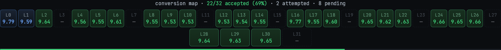
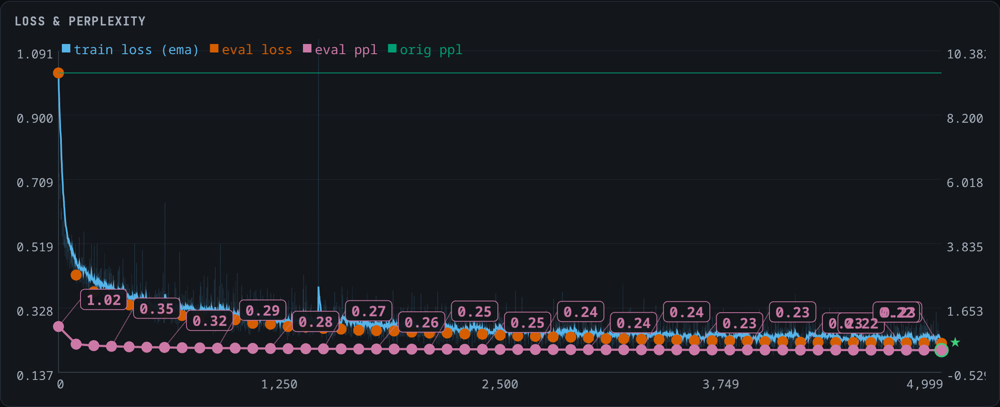
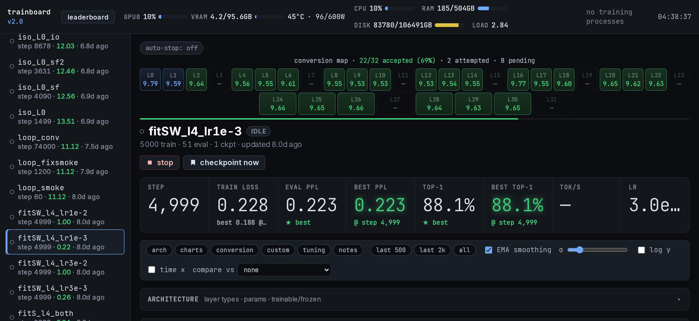
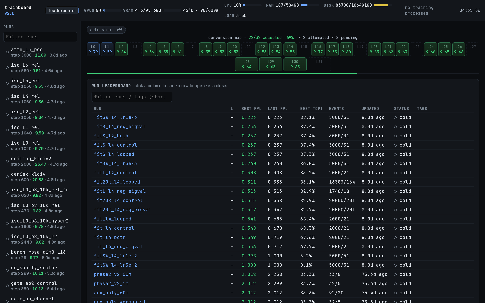

# RWKV-Lab

**Cross-architecture LLM conversion, looped recurrence, and memory research — on RWKV linear-attention cores.**

RWKV-Lab is a research codebase for taking a *pretrained* Transformer / gated-linear-attention model and turning it into an efficient **RWKV-style linear-attention** model — without pretraining from scratch. The headline target is [Qwen3.5-9B-Base](#target-model), a 32-layer hybrid (24 gated-delta-net layers + 8 full-attention layers), which we convert layer-by-layer to RWKV-7/8 kernels and then extend with weight-tied **loops** (recurrent depth), an **Engram** lexical memory bank, and **ROSA** suffix-matching retrieval.

The through-line: *the RWKV-7 recurrence is expressive enough to absorb a gated-delta-net exactly, and expressive enough to absorb softmax attention with a short distillation.* Everything here is built around exploiting that.

<p align="center">
  <br>
  <em>Live conversion map — 22/32 layers converted to RWKV and accepted. The 8 dashed cells (L3, L7, … L31) are the full-attention layers still being distilled; the green cells are the gated-delta-net layers, which convert <strong>losslessly</strong>.</em>
</p>

---

## The core result

Qwen3.5's linear-attention layers are **gated DeltaNet (GDN)**. We proved — algebraically and end-to-end — that **GDN's gated-delta recurrence is an exact special case of the RWKV-7 `wkv7` kernel** at matched head dimensions:

```
Given GDN kernel inputs (q, k, v, g, β), with q/k L2-normalized:
    r        = normalize(q)
    gk       = g                       # GDN's scalar log-decay, broadcast over the key dim
    k_write  = β · normalize(k)
    a        = −normalize(k)           # delta-rule removal key
    b        = normalize(k) · exp(g)·β # in-context learning rate
    out      = wkv7(r, gk, k_write, v, a, b) · (1/√head_dim)
```

Feeding a GDN layer's own activations through this map reproduces its output at **cosine 0.999995**. Patching all 24 GDN layers of the full 9B model changes perplexity by **+0.013%** (8.4898 → 8.4908) — with **zero training**. See [`convert_gdn_lossless.py`](convert_gdn_lossless.py).

That collapses the conversion problem to just the **8 full-attention layers**, which are *not* a linear-attention subset and need distillation ([RADLADS](#code--upstream-references)-style block-alignment + logit-KD). The `attn_L3_poc.py` proof-of-concept and the `convert_train.py` per-layer trainer target exactly those.

> **Why this matters:** an earlier version of this project built the RWKV core at head-size 64 against GDN's 32×128, a self-imposed 2:1 state compression that *forced* a whole distillation-and-codec pipeline. The matched-dimension remap makes 24 of 32 layers free. The "RWKV-7 decay floor" that dogged early runs turned out to be a parametrization artifact, not a kernel limit.

---

## Screenshots

Training is driven and monitored through **trainboard**, a from-scratch Go + SQLite + [Datastar](https://data-star.dev/) + [Pixi.js](https://pixijs.com/) dashboard ([`dashboard2/`](dashboard2/)) that ingests every run's `train.jsonl` and paints the whole-model conversion state live.

<p align="center">
  <br>
  <em>A single GDN→RWKV layer conversion (block-relative distillation): train loss 1.09 → 0.22, next-token top-1 88%, converging to the frozen-teacher reference line (green).</em>
</p>

<p align="center">
  <br>
  <em>Per-run view: KPI tiles (step, loss, eval PPL, top-1), the conversion map, and per-layer status.</em>
</p>

<p align="center">
  <br>
  <em>Run leaderboard — the conversion is an experiment sweep: hundreds of isolated per-layer runs, ablations (looped vs. control, neg-eigval, schedule-free), and optimizer studies, all sortable by best PPL / top-1 / recency.</em>
</p>

---

## Target model

**Qwen3.5-9B-Base** — a 32-layer, hidden-size-4096 hybrid:

| | Layers | Mechanism | Geometry |
|---|---|---|---|
| **Linear** | 24 (all except every 4th) | Gated DeltaNet (GDN) | 32 value heads × 128, 16 key heads × 128 |
| **Full attention** | 8 (indices 3, 7, 11, 15, 19, 23, 27, 31) | Gated GQA + RoPE + per-head q/k-norm | 16 query heads × 256, 4 KV heads (GQA rep 4) |

A second track targets **Qwen3.6-35B-A3B** (a Mixture-of-Experts model) for the MLA / Engram experiments — the origin of this repo's old `moe-mla` name.

---

## What you need locally

This repo does not contain model weights, token caches, run logs, or checkpoints. The scripts assume those exist on disk and expose flags for the paths:

| Input | Used by | Notes |
|---|---|---|
| Qwen3.5-9B-Base weights | conversion, baseline eval, target extraction | Pass with `--model-dir`, or put the HF snapshot at `Qwen3.5-9B-Base`. |
| Tokenized eval/train stream | `eval_baseline.py`, `build_memory_targets.py`, `convert_train.py` | `--data` may be a cache directory or a flat `tokens.bin` accepted by `build_memory_targets.load_token_stream`. |
| CUDA Torch + `fla` | RWKV-7 kernel path | Install these for your CUDA stack; `requirements.txt` only covers the regular Python deps. |
| Go toolchain | `dashboard2/` | Needed only for trainboard. |

For a small data-format smoke test, `build_qwen35_data.py --max-docs 1000 --out_root /tmp/qwen35-cache` writes the same flat-cache format without pulling the full corpus.

---

## Repository layout

Everything is a **drop-in `linear_attn` / attention module swap** on a HuggingFace decoder layer, plus trainers and offline builders around them. Model weights, datasets, checkpoints, and the paper PDFs are **git-ignored** (>1.5 TB locally) — this repo is the *code*.

### Conversion core
| File | Role |
|---|---|
| [`rwkv8_deltanet.py`](rwkv8_deltanet.py) | RWKV-7/8 time-mix + channel-mix modules (port of BlinkDL's `RWKV_Tmix_x070`), using `fla`'s Triton `wkv7` kernel with a Python reference fallback. The swap target. |
| [`convert_gdn_lossless.py`](convert_gdn_lossless.py) | The lossless GDN→RWKV-7 kernel remap (proven above). Weight-preserving, zero training. |
| [`convert_train.py`](convert_train.py) | Single-layer conversion trainer: block-MSE + logit-KL + SMT/DMT state distillation, stability guards, spectral-optimizer levers. See [`TRAINING_LEVERS.md`](TRAINING_LEVERS.md). |
| [`smt_dmt.py`](smt_dmt.py) | Supervised (one-step) + Dynamical (closed-loop rollout) Memory Training + the bilinear state codec. |
| [`distill_objectives.py`](distill_objectives.py) | Alignment-invariant / relational distillation losses (CKA, relative-L2). |
| [`attn_L3_poc.py`](attn_L3_poc.py) | Full-attention→RWKV proof-of-concept (RADLADS init + freeze-most), self-contained. |
| [`layer_swap.py`](layer_swap.py), [`svd_init.py`](svd_init.py) | Hot-swap a decoder layer's mixer; SVD-based weight transfer. |
| [`build_memory_targets.py`](build_memory_targets.py) | Extract frozen-teacher GDN state/block targets for the SMT/DMT caches. |
| [`assemble_looped.py`](assemble_looped.py), [`drive_isolation.py`](drive_isolation.py), [`distill_consolidate.py`](distill_consolidate.py) | Assemble independently-converted layers into one looped model; drive the per-layer sweep; joint consolidation pass. |
| [`load_converted.py`](load_converted.py), [`eval_baseline.py`](eval_baseline.py) | Load a converted stack; evaluate the untouched base for reference PPL. |

### Looped recurrence (recurrent depth)
| File | Role |
|---|---|
| [`looped_rwkv.py`](looped_rwkv.py) | Weight-tied N-loop refinement wrapper (pre-norm + zero-init residual gate ⇒ identity at init). Factored head/channel gates, spectral-radius cap, hyper-connection lanes. |
| [`loop_probe.py`](loop_probe.py) | Loop-iterate diagnostics + depth-usefulness sweep. |
| [`looped_rwkv_rosa_engram_v3.py`](looped_rwkv_rosa_engram_v3.py) | The integrated looped + ROSA + Engram core. |

### Memory: Engram + ROSA
| File | Role |
|---|---|
| [`engram_lmb.py`](engram_lmb.py), [`engram_lmb_build.py`](engram_lmb_build.py) | Lexical Memory Bank — a suffix-automaton-recalled embedding memory (offline builder + runtime module). |
| [`engram_integration.py`](engram_integration.py), [`build_engram_patch.py`](build_engram_patch.py), [`gpu_engram_prefill.py`](gpu_engram_prefill.py) | Wiring, patch builder, GPU prefill of the memory table. |
| [`rosa.py`](rosa.py), [`rosa_sam.py`](rosa_sam.py), [`rosa_soft_layer.py`](rosa_soft_layer.py) | ROSA suffix-matching retrieval (v1 drop-in, online suffix-automaton kernel, soft-retrieval layer). |
| [`verify_engram.py`](verify_engram.py), [`load_mla_engram.py`](load_mla_engram.py) | Verification + combined MLA+Engram loader. |

### MLA (Multi-head Latent Attention)
| File | Role |
|---|---|
| [`mla_module.py`](mla_module.py) | DeepSeek-V2/V3-style MLA attention module (hot-swappable). |
| [`train_mla.py`](train_mla.py), [`train_mla_engram.py`](train_mla_engram.py) | GQA→MLA finetune trainers (frozen backbone, MLA-only params). |

### Prediction objectives (research modules, training-only, default-off)
| File | Role |
|---|---|
| [`mtp_module.py`](mtp_module.py), [`parallel_heads_module.py`](parallel_heads_module.py) | Multi-token-prediction auxiliary heads (Gloeckle-style). |
| [`mutor_module.py`](mutor_module.py) | MuToR register-token auxiliary MTP. |
| [`lookahead_module.py`](lookahead_module.py), [`fsp_module.py`](fsp_module.py) | Latent-lookahead + future-summary auxiliary objectives. |
| [`pc_layer.py`](pc_layer.py) | PC-Layer polynomial weight preconditioning. |

### Optimizers & diagnostics
| File | Role |
|---|---|
| [`muon_helpers.py`](muon_helpers.py), [`spectral_muon.py`](spectral_muon.py) | MuonClip helpers; one configurable Muon-family optimizer collecting the 2026 spectral-optimizer literature (Muonᵖ, DDC, distance-aware, hierarchical, …). |
| [`llr.py`](llr.py) | Heavy-tail layerwise learning rate. |
| [`grokking_metrics.py`](grokking_metrics.py), [`grok_autopilot.py`](grok_autopilot.py) | Memorization-vs-grokking diagnostics + reactive recovery. |

### Infra
| File | Role |
|---|---|
| [`dashboard2/`](dashboard2/) | **trainboard** — Go + SQLite + Datastar + Pixi.js real-time training dashboard (see its [README](dashboard2/README.md)). |
| [`live_controls.py`](live_controls.py) | Trainer-side consumer of the dashboard's live-tuning panel. |
| [`safe_torch.py`](safe_torch.py) | Safer torch-serialization load wrappers. |
| [`build_qwen35_data.py`](build_qwen35_data.py) | Build Qwen3.5-tokenized DCLM + FineWeb-Edu caches. |
| `test_*.py` | CPU/GPU invariant + feature tests (loops, lookahead, Engram, ROSA persistence, CUDA-graph rollout, compile). |
| [`legacy/`](legacy/) | Retired v1 dashboard + earlier trainer snapshots, kept for provenance. |

---

## Pipeline

```bash
# 0. install Python deps, then install CUDA-specific torch + fla separately
pip install -r requirements.txt

MODEL_DIR=/path/to/Qwen3.5-9B-Base
DATA=/path/to/qwen3.5-token-cache-or-tokens.bin

# 1. baseline eval on the same windows used by conversion runs
python eval_baseline.py --model-dir "$MODEL_DIR" --data "$DATA" --out runs/_baseline.json

# 2. GDN layers — lossless, no training
python -c "from transformers import AutoModelForCausalLM; \
           from convert_gdn_lossless import install_lossless_wkv7; \
           m = AutoModelForCausalLM.from_pretrained('$MODEL_DIR'); \
           print(install_lossless_wkv7(m), 'GDN layers converted')"

# 3. attention layers — per-layer distillation against the frozen original
python build_memory_targets.py --model-dir "$MODEL_DIR" --data "$DATA" --layer 3 --out mem_targets/L3
python convert_train.py --model-dir "$MODEL_DIR" --data "$DATA" \
  --layer 3 --codec-cache mem_targets/L3 --out runs/iso_L3 --steps 10000

# 4. assemble accepted isolated layers, then consolidate
python assemble_looped.py runs/iso_L*/best/ckpt.pt --out Qwen3.5-9B-RWKV/rwkv_layers_looped.pt
python distill_consolidate.py --model-dir "$MODEL_DIR" --data "$DATA" \
  --rwkv-ckpt Qwen3.5-9B-RWKV/rwkv_layers_looped.pt \
  --kl-weight 1.0 --out Qwen3.5-9B-RWKV/rwkv_layers_distilled.pt

# 5. watch it (separate terminal)
go -C dashboard2 run ./cmd/trainboard   # http://127.0.0.1:9124
```

> Many script defaults point at the author's local layout (`/thearray/git/moe-mla/...`). Treat those as examples and pass explicit paths. Every training lever defaults **off** — at default flags the trainers reproduce the plain baseline. See [`TRAINING_LEVERS.md`](TRAINING_LEVERS.md).

---

## Status

| Component | State |
|---|---|
| GDN → RWKV-7 lossless kernel (24 layers) | ✅ Proven (cosine 0.999995; +0.013% full-model PPL) |
| Per-layer isolation conversion + sweep | ✅ 22/32 layers converted & accepted |
| Full-attention → RWKV distillation (8 layers) | 🚧 In progress (RADLADS PoC floors at block-rel 0.234; RoPE/q-norm are the gap) |
| Assemble + joint consolidation | ✅ Tooling complete |
| LoopedRWKV, Engram LMB, ROSA | ✅ Modules + tests green; integration ongoing |
| Next-latent prediction | 🔭 Planned |

This is an active research codebase, not a released library. Results are reproducible from the scripts here given the base weights; the end-to-end converted 9B model is still being assembled.

---

## References

### Papers we build on

Only papers with a concrete implementation or adopted design decision in this repo are listed (each maps to the module named, arXiv id linked). The wider reading pile is intentionally not committed.

**Architecture conversion**
- [Gated Delta Networks: Improving Mamba2 with Delta Rule](https://arxiv.org/abs/2412.06464) — the source linear-attention mechanism → [`convert_gdn_lossless.py`](convert_gdn_lossless.py)
- [Parallelizing Linear Transformers with the Delta Rule over Sequence Length](https://arxiv.org/abs/2406.06484) — the chunked delta-rule recurrence behind the `wkv7` kernel → [`rwkv8_deltanet.py`](rwkv8_deltanet.py)
- [Comba: Improving Bilinear RNNs with Closed-loop Control](https://arxiv.org/abs/2506.02475) — the state-query readout-correction scalar → [`rwkv8_deltanet.py`](rwkv8_deltanet.py)
- [RADLADS: Rapid Attention Distillation to Linear Attention Decoders at Scale](https://arxiv.org/abs/2505.03005) — the attention→RWKV protocol (block-align → logit-KL → CE), RAD-RWKV7 RoPE-on-r/k init → [`attn_L3_poc.py`](attn_L3_poc.py), [`convert_train.py`](convert_train.py)
- [Taylor-Calibrate: Principled Initialization for Hybrid Linear Attention Distillation](https://arxiv.org/abs/2606.16429) — half-life decay init from teacher attention look-back (adapted to RWKV-7) → [`taylor_calibrate.py`](taylor_calibrate.py)
- [Attention to Mamba: A Recipe for Cross-Architecture Distillation](https://arxiv.org/abs/2604.14191) — portable pieces (Hedgehog feature map φ + attention-map CE) as standalone utilities → [`hedgehog.py`](hedgehog.py)
- [Comba: Improving Bilinear RNNs with Closed-loop Control](https://arxiv.org/abs/2506.02475) — output-feedback readout (already `out_correct_d`) + optional decoupled removal strength → [`rwkv8_deltanet.py`](rwkv8_deltanet.py) (`--comba`)

**Looped / recurrent depth**
- [Hyper-Connections](https://arxiv.org/abs/2409.19606) — per-pass hyper-connection lanes at the loop boundary → [`looped_rwkv.py`](looped_rwkv.py)
- [How Much Is One Recurrence Worth: Iso-Depth Scaling Laws for Looped LMs](https://arxiv.org/abs/2604.21106) — full-BPTT loop-training decision → [`looped_rwkv.py`](looped_rwkv.py), [`loop_probe.py`](loop_probe.py)
- [Dense Supervision Is Not Enough: The Readout Blind Spot in Looped LMs](https://arxiv.org/abs/2606.24898) — per-iterate readout supervision so every loop pass stays decodable → [`looped_rwkv.py`](looped_rwkv.py) (`--loop-iter-readout`)
- [ChainGPT: Dual-Reasoning Model with Recurrent Depth and Multi-Rank State Updates](https://openreview.net/forum?id=kdZbxizwGK) — RWKV-Product: M low-rank delta sub-steps per token (effective rank-M state) through one wkv7 call → [`rwkv_product.py`](rwkv_product.py)
- [PonderNet](https://arxiv.org/abs/2107.05407) / [ACT](https://arxiv.org/abs/1603.08983) — per-token adaptive loop depth via a halt head + halt-weighted output + ponder loss (the intended capability behind MoDr, which is actually a branch-router) → [`looped_rwkv.py`](looped_rwkv.py) (`--loop-adaptive-halt`)

**Memory (Engram / ROSA)**
- [Engram](https://github.com/deepseek-ai/Engram) (DeepSeek; offline conditional memory) → [`engram_lmb.py`](engram_lmb.py)
- Embedding-memory design rules (param cap, amplification, freq-aware n-grams) → [`engram_lmb_build.py`](engram_lmb_build.py): [Memory Grafting](https://arxiv.org/abs/2605.20948) · [STEM](https://arxiv.org/abs/2601.10639) · [X-GRAM](https://arxiv.org/abs/2604.21724) · [Scaling Embeddings Outperforms Scaling Experts](https://arxiv.org/abs/2601.21204)
- [ROSA-Tuning: Enhancing Long-Context Modeling via Suffix Matching](https://arxiv.org/abs/2602.02499) → [`rosa.py`](rosa.py), [`rosa_sam.py`](rosa_sam.py)
- [Fast-weight Product Key Memory](https://arxiv.org/abs/2601.00671) — product-key episodic memory (√N sub-keys, IDW scoring, gated residual) + memorization/addressing objectives → [`fwpkm.py`](fwpkm.py)

**Latent attention & prediction objectives**
- [DeepSeek-V2](https://arxiv.org/abs/2405.04434) (Multi-head Latent Attention) + [DeepSeek-V3](https://arxiv.org/abs/2412.19437) (MTP) → [`mla_module.py`](mla_module.py), [`mtp_module.py`](mtp_module.py)
- [Better and Faster LLMs via Multi-token Prediction](https://arxiv.org/abs/2404.19737) (Gloeckle et al.) → [`parallel_heads_module.py`](parallel_heads_module.py)
- [MuToR: register-token multi-token prediction](https://arxiv.org/abs/2505.10518) → [`mutor_module.py`](mutor_module.py)
- [TOP: Predicting the Order of Upcoming Tokens](https://arxiv.org/abs/2508.19228) · [NextLat: next-latent prediction](https://arxiv.org/abs/2511.05963) · [ConceptLM: next-concept prediction](https://arxiv.org/abs/2602.08984) → [`lookahead_module.py`](lookahead_module.py)
- [Beyond Multi-Token Prediction: Pretraining LLMs with Future Summaries](https://arxiv.org/abs/2510.14751) → [`fsp_module.py`](fsp_module.py)
- [L-MTP: Leap Multi-Token Prediction](https://arxiv.org/abs/2505.17505) — leap heads predicting non-adjacent offsets {k+1, 2k+1, …} → [`lookahead_module.py`](lookahead_module.py) (`--lmtp-weight`)
- [The Belief State Transformer](https://arxiv.org/abs/2410.23506) — forward+backward next/prev objective (cheap adapter: reuse decoder hidden + shallow backward GRU) → [`lookahead_module.py`](lookahead_module.py) (`--bst-weight`)
- [JTP: Efficient Joint Prediction of Multiple Future Tokens](https://arxiv.org/abs/2503.21801) — joint MTP via a Fetch self-attention bottleneck; composes with the Belief State head (forward-joint + backward-prev on one hidden) → [`lookahead_module.py`](lookahead_module.py) (`--jtp-weight`)
- [LLM-JEPA: LLMs Meet Joint Embedding Predictive Architectures](https://arxiv.org/abs/2509.14252) (LeCun et al.) — paired-view (Text↔Code) latent objective: predict one view's embedding from the other via `[PRED]` tokens, cosine loss, no stop-grad (an SFT-phase objective for a coding model's NL/code pairs) → [`llm_jepa.py`](llm_jepa.py)

**Optimizers & training dynamics**
- [Muon](https://kellerjordan.github.io/posts/muon/) + [MuonClip / QK-Clip](https://arxiv.org/abs/2507.20534) (Kimi K2) — the base orthogonalized-momentum optimizer + attention-logit-stabilizing clip → [`muon_helpers.py`](muon_helpers.py)
- Configurable spectral-Muon levers in [`spectral_muon.py`](spectral_muon.py): [Muonᵖ spectral-power orthogonalization](https://arxiv.org/abs/2606.13867) · [Muon²](https://arxiv.org/abs/2604.09967) · [MuonEq](https://arxiv.org/abs/2603.28254) · [Aurora](https://arxiv.org/abs/2606.27715) · [Muon⁺](https://arxiv.org/abs/2602.21545) · [MONA](https://arxiv.org/abs/2605.26842) · [DDC (Dead-Direction Conditioner)](https://arxiv.org/abs/2606.29176) · [odd-cubic Newton–Schulz](https://arxiv.org/abs/2606.00371) · [SpecMuon RSAV](https://arxiv.org/abs/2602.16167) · [Hierarchical/tiled Muon](https://arxiv.org/abs/2606.27216) · [Distance-Aware Muon](https://arxiv.org/abs/2605.18999) · [ARO-Sinkhorn](https://arxiv.org/abs/2602.09006) (all off by default)
- [PC-Layer polynomial preconditioning](https://arxiv.org/abs/2606.06470) + [Heavy-Tail Layerwise LR](https://arxiv.org/abs/2605.22297) → [`pc_layer.py`](pc_layer.py), [`llr.py`](llr.py)
- [Spectral Scaling Laws of Muon](https://arxiv.org/abs/2606.04058) — final-layer momentum shrinks below the Newton–Schulz floor at scale; route the readout to more NS steps → [`convert_train.py`](convert_train.py) (`--sm-ns-steps-final`)
- [Grokfast: Accelerated Grokking by Amplifying Slow Gradients](https://arxiv.org/abs/2405.20233) + [late-stage un-grokking recovery](https://arxiv.org/abs/2602.02859) — memorization-vs-grokking diagnostics → [`grokking_metrics.py`](grokking_metrics.py), [`grok_autopilot.py`](grok_autopilot.py)
- [CODA: Rewriting Transformer Blocks as GEMM-Epilogue Programs](https://arxiv.org/abs/2605.19269) — throughput; the portable torch.compile-fusion subset (full CODA needs custom CuTeDSL) → [`coda.py`](coda.py)

### Code & upstream references

| Project | Use here |
|---|---|
| [BlinkDL/RWKV-LM](https://github.com/BlinkDL/RWKV-LM) | The RWKV-7/8 time-mix design; `run_rwkv7_qwen35.py` validated our GDN→RWKV mapping. |
| [fla-org/flash-linear-attention](https://github.com/fla-org/flash-linear-attention) | Triton `chunk_rwkv7` / `wkv7` kernels used throughout. |
| [RADLADS (Recursal)](https://arxiv.org/abs/2505.03005) · [recursal/QRWKV](https://huggingface.co/recursal) | The attention→RWKV distillation protocol (block-align → logit-KL → CE) and RAD-RWKV7 init. |
| [OpenMOSE](https://github.com/OpenMOSE) | Normalized-MSE + logit-KL conversion recipe guidance. |
| DeepSeek-V2/V3 | MLA formulation ([`mla_module.py`](mla_module.py)). |
| [Qwen3.5 / Qwen](https://github.com/QwenLM) · [HF Transformers](https://github.com/huggingface/transformers) | Base model + modeling code. |
| [Muon (Keller Jordan)](https://github.com/KellerJordan/Muon) · [schedule-free](https://github.com/facebookresearch/schedule_free) | Optimizer bases. |
| [Datastar](https://data-star.dev/) · [Pixi.js](https://pixijs.com/) | trainboard front-end (hypermedia SSE + WebGL charts). |

---

## Acknowledgments

Special thanks to **[BlinkDL](https://github.com/BlinkDL)** (creator of RWKV) and **[OpenMOSE](https://github.com/OpenMOSE)** for their direct guidance on this work — BlinkDL for the RWKV-7 architecture and sharing the `run_rwkv7_qwen35.py` reference that confirmed our GDN→RWKV kernel mapping, and OpenMOSE for the normalized-MSE + logit-KL conversion recipe and RADLADS pointers that shaped the distillation pipeline. This project would not have gotten off the ground without their generosity.

---

## License

[MIT](LICENSE) — original code in this repository. The referenced papers, base model weights (Qwen3.5/3.6), and upstream projects retain their own licenses; this repo contains no model weights or copyrighted PDFs.

*RWKV-Lab is independent research and is not affiliated with the RWKV project, Recursal, or Alibaba/Qwen.*
